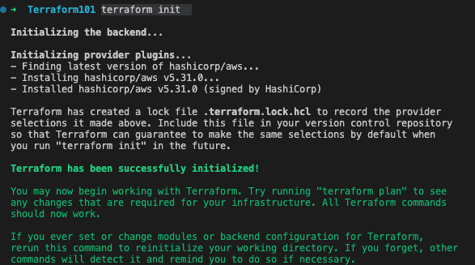

# Terraform

Terraform is an open-source infrastructure as code (IaC) software tool created by HashiCorp. It enables users to define and provision a datacenter infrastructure using a high-level configuration language known as HashiCorp Configuration Language (HCL), or optionally JSON.

Here's a breakdown of its key features and functionalities:

- Infrastructure as Code: Terraform allows you to describe your infrastructure and services in code, which can be versioned, shared, and reused.

- Provider Ecosystem: It supports a wide range of providers such as AWS, Microsoft Azure, Google Cloud Platform, and many others, allowing it to manage a variety of services and systems.

- Resource Management: Terraform can manage both low-level components (compute instances, storage, and networking) and high-level components (DNS entries, SaaS features).

- State Management: Terraform maintains a state file to track the state of the managed infrastructure and services. This is crucial for making changes and upgrades.

- Modular Design: You can organize Terraform configurations using modules, which makes them more manageable and reusable.

- Plan & Apply Workflow: Terraform generates an execution plan describing what it will do to reach the desired state, and then executes it to build the described infrastructure.

- Change Automation: It helps in automating changes to the infrastructure with minimal human interaction, ensuring that the infrastructure evolves safely and reliably.

```
terraform init
```



resource block examples- this is for aws
https://registry.terraform.io/providers/hashicorp/aws/latest/docs

to run terraform
```
terraform apply
or
terraform apply -var "instance_name=MyNewNameEC2"
```


main.tf         - file where the infrastructure is present
varaibles.tf    - file in which variables are defined
terraform.tfvars- file in which the variables are defined which can rename the defaults from variables
                    use this insted of adding var when running terraform apply
output.tf       - outputs data from the infrastructure


to see outputs
```
terraform output
```

to remove infrastructure
```
terraform destroy
```